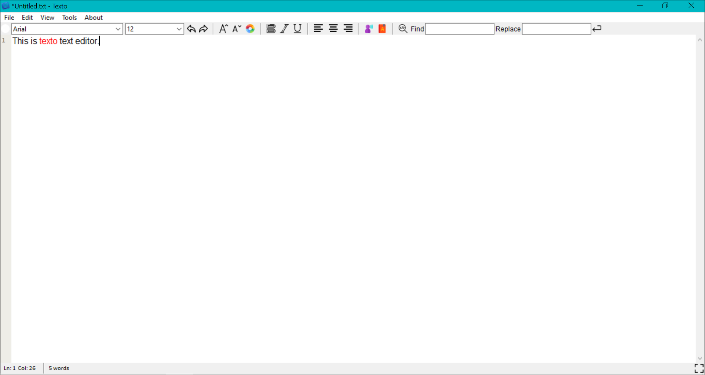
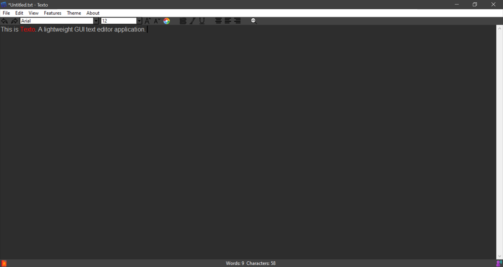

# Texto
Texto is a GUI text-editor made in Tkinter (python). It is basically an advance version of *Notepad* application.   

Additional features include:
* Spell checker
* Text to Speech 
* Find and replace
* Theme changer
* Word and character counter

&ensp;

# Downloading
Download and unzip [texto.zip](texto.zip) and run *texto.exe*

&ensp;

## Features:

0. _*Upcoming Features Roadmap*_
   * *UI changes*
   * *Spelling checker with correction option*
   * *ToolTips (i.e. Button Labels)*
   * *Contextual Menu (i.e. Right Click Menu)*
   * *FullScreen Mode(F11 and Esc)*
   * *Line Number SideBar* 
   * *Tab spacing options*
   
   
1. **Basic Features**
    * New
    * Save/Save As
    * Open/Close
    * Cut/Copy/ Paste
    * Select All
1. **Font change options**
    * Bold, Italics, Underline
    * Size
    * Font Family
    * Font Color
    
1. **Alignment change options**
    * Left Align
    * Right Align
    * Center Align
1. **Word and character counter**
    * Counts the number of words and character written
    
1. **Application theme changer**
    * Contains multiple themes such as Dark, Red, Monokai, Night Blue etc.

1. **Find and Replace**
    * Finds the matching word/sentence and highlights it (with yellow background). 
    * The words can also be replaced with another word/sentence.

1. **Spell-checker**
    * (*When ON*) Checks the spelling of each word and highlights(in red) any unknown word.

1. **Text to Speech**
    * (*When ON*) Speaks the selected text (when pressed the button or Ctrl+T).
    
&ensp;
# Images

&ensp;

### #DarkMode

&ensp;

# Credits
Icons made by [Freepik](https://www.flaticon.com/authors/freepik) from [www.flaticon.com](https://www.flaticon.com/)
