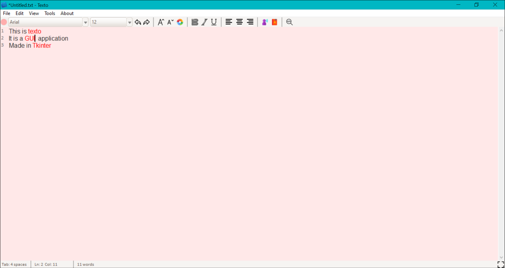

# Texto
Texto is a GUI text-editor made in Tkinter (python). It is basically an advance version of *Notepad* application.   

Additional features include:
* Spelling Checker and Corrector
* Text to Speech 
* Find and replace
* Number-Line Sidebar
* Theme changer
* Line and Column number
* Word counter
* FullScreen Mode

&ensp;

# Downloading
Download and install [Texto-1.1-amd64.msi](https://github.com/RashimNarayanTiku/Texto/raw/master/Texto-1.1-amd64.msi) and run *texto.exe*

&ensp;

## Features:

0. **Recently added Features**
   * *Improved spelling checker with word correction option*
   * *Line Number SideBar (With dynamic size adjuster)*
   * *ToolTips (i.e. Button Labels)*
   * * Tab-size change option*
   * *Contextual Menu (i.e. Right Click Menu)*
   * *FullScreen Mode(F11 and Esc)* 
   * *UI changes*
   
   
1. **Basic Features**
    * New
    * Save, Save As
    * Open, Close
    * Cut, Copy, Paste
    * Select All
1. **Font change options**
    * Bold, Italics, Underline
    * Font Size, Family, Color
    
1. **Alignment change options**
    * Left Align
    * Right Align
    * Center Align
    

1. **Spell-checker and Corrector**
    * (*When ON*) Checks the spelling of each word and highlights(in red) any unknown word.
    * Also suggests list of words to choose and fix the word.

1. **Text to Speech**
    * (*When ON*) Speaks the selected text (when pressed the button or Ctrl+T).
    
1. **Application theme changer**
    * Contains multiple themes such as White, Monokai, Dark, Red, Blue etc.

1. **Number-Line Sidebar**
    * It shows the line number along with text area and updates accordingly.
    * Updates dynamically based on the space required.
    * It can be removed if not required in 'View' tab.
    
1. **Find and Replace**
    * Finds the matching word/sentence and highlights it (with yellow background). 
    * The words can also be replaced with another word/sentence.

1. **Word counter**
    * Counts the number of words and character written.
    
1. **Line and Column Number**
    * Follows the mouse pointer and keeps the track of line and column number in the editor.
    
&ensp;
# Images

&ensp;

### #Red Theme

&ensp;

# Credits
Icons made by [Freepik](https://www.flaticon.com/authors/freepik) from [www.flaticon.com](https://www.flaticon.com/)
